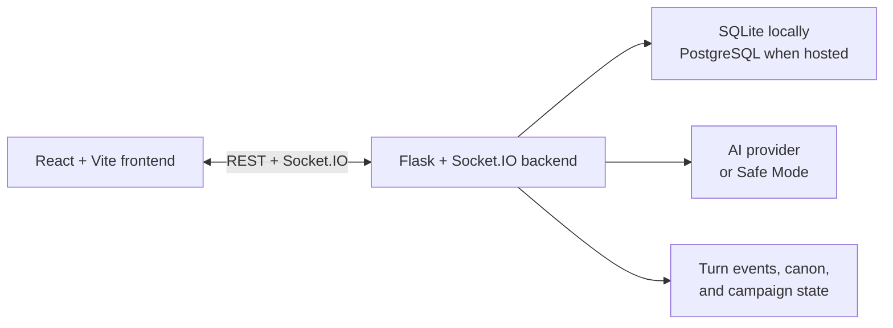

# AI-DM

**A persistent AI Dungeon Master and live tabletop console for story-driven
campaigns.**

[Play the live beta](https://playaidm.com) ·
[Explore the documentation](#documentation) ·
[Report an issue](https://github.com/dreichner2/AI-DM/issues)

AI-DM brings the campaign, party, live table, rules helpers, and AI narration
into one place. It remembers what happened, applies structured state changes,
and carries the world's canon forward from one session to the next.

> [!NOTE]
> AI-DM is under active development and is currently a closed beta. The hosted
> build requires an account; the repository can also be run entirely on your
> own machine.

## What makes it different

A normal chatbot can narrate a scene. AI-DM maintains the game around that
scene.

- **Persistent campaigns** — worlds, campaigns, characters, sessions,
  inventory, equipment, maps, and history survive between play sessions.
- **A live shared table** — Socket.IO powers streaming turns, player presence,
  typing status, turn control, music, and clarification prompts.
- **Durable continuity** — turn events, state snapshots, rolling summaries,
  canon, and emergent memory keep the story coherent.
- **Rules-aware play** — dice checks, combat state, health, creatures, and
  action validation add structure without taking over the story.
- **DM tools** — create or import adventures, manage encounters and maps,
  inspect state, and export a campaign Chronicle.
- **Flexible AI** — use Codex, Gemini, DeepSeek, NVIDIA/Kimi, or the built-in
  deterministic Safe Mode.

## Start playing

### Use the hosted beta

1. Open [playaidm.com](https://playaidm.com).
2. Sign up and create or join a table.
3. Choose **Play Now** for a ready-made opening adventure, or create your own
   campaign.

### Run it locally

You will need:

- Python 3.14.6
- Node.js 24.18.0
- npm 12.0.0
- a Unix-like shell

The required versions are pinned in
[.python-version](.python-version),
[.nvmrc](.nvmrc), and
[aidm_frontend/package.json](aidm_frontend/package.json).

```bash
git clone https://github.com/dreichner2/AI-DM.git
cd AI-DM
make install
make unified
```

Then open [http://127.0.0.1:5050](http://127.0.0.1:5050).

`make unified` builds the frontend when needed and serves the UI, API,
Socket.IO, and TTS routes from one local origin. Check the running backend with:

```bash
curl http://127.0.0.1:5050/api/health
```

No provider key is required to start. Without one, AI-DM uses deterministic
Safe Mode so you can explore the interface and test the game flow.

## Connect an AI provider

Local settings live in `.env.local`, which is loaded automatically and ignored
by Git.

```bash
cp .env.local.example .env.local
```

Choose one provider:

| Provider | Minimal local configuration |
| --- | --- |
| Codex CLI | `AIDM_LLM_PROVIDER=codex_cli` with Codex installed and a dedicated signed-in `AIDM_CODEX_HOME`; AIDM runs it as a host-isolated narrator |
| Gemini | `GOOGLE_GENAI_API_KEY=...` |
| DeepSeek | `AIDM_DEEPSEEK_API_KEY=...` |
| NVIDIA / Kimi | `AIDM_NVIDIA_API_KEY=...` |
| Safe Mode | No key, or `AIDM_LLM_PROVIDER=fallback` |

When `AIDM_LLM_PROVIDER` is omitted, the local launcher detects Gemini,
DeepSeek, then NVIDIA credentials before falling back to Safe Mode. Models and
provider capabilities are defined in
[aidm_server/provider_registry.py](aidm_server/provider_registry.py).

Never commit `.env.local` or paste real credentials into logs, issues, or
screenshots.

The Codex adapter does not expose the repository, service environment, shell,
network, web search, apps, plugins, skills, MCP, or host configuration to
gameplay prompts. Each turn runs in an empty read-only disposable workspace.
The pinned CLI can still offer a small set of built-in local utility tools;
filesystem permissions confine them to that empty workspace and required
runtime files, while AIDM rejects any structured tool event present in Codex's
JSONL output. Saved-login deployments must use a persistent, AIDM-only
`AIDM_CODEX_HOME` so token refreshes persist without loading a user's Codex
configuration or history.

## Development

For Vite hot reload, run the backend and frontend separately:

```bash
# Terminal 1
make backend
```

```bash
# Terminal 2
make frontend
```

The Vite app proxies API and Socket.IO traffic to the local backend.

### Useful commands

| Command | Purpose |
| --- | --- |
| `make install` | Create the virtualenv and install pinned backend/frontend dependencies |
| `make unified` | Build and run the complete single-origin app |
| `make backend` | Run the Flask/Socket.IO backend |
| `make frontend` | Run the Vite development server |
| `make test` | Run the backend test suite |
| `cd aidm_frontend && npm run test` | Type-check, lint, and test the frontend |
| `make dev-check` | Run the fast local correctness and drift checks |
| `make browser-smoke` | Exercise the main flow in a real browser |
| `make closed-beta-rc` | Run the full closed-beta release-candidate gate |

Release engineering, evidence generation, and hosted operations commands are
documented in the [release checklist](docs/release_checklist.md) and
[beta runbook](docs/beta_runbook.md).

## How it fits together



- [`aidm_frontend/`](aidm_frontend/) contains the React interface, session
  board, campaign tools, and client-side runtime state.
- [`aidm_server/`](aidm_server/) contains the API, sockets, turn engine,
  providers, rules, state services, and deployment bootstrap.
- [`tests/`](tests/) contains backend coverage; frontend tests live beside their
  components in `aidm_frontend/src/`.
- [`migrations/`](migrations/) contains the Alembic database history.
- [`scripts/`](scripts/) contains local launchers, authoring tools, smoke tests,
  repair utilities, and release checks.

Local data is stored in `~/.aidm/dnd_ai_dm.db` by default. Hosted environments
use PostgreSQL and must run the checked migration and production bootstrap
paths.

## Campaign packs

Campaign packs are structured JSON adventures. They can define locations,
NPCs, quests, encounters, branches, checkpoints, hidden information, and
progress rules, then be linted and imported into AI-DM.

Start with:

- [Campaign pack guide](docs/campaign_packs.md)
- [JSON schema](docs/campaign_pack.schema.json)
- [Example adventures](docs/examples/)

Validate a pack before importing it:

```bash
.venv/bin/python scripts/aidm_pack.py lint path/to/campaign.json
```

## Documentation

| If you want to understand... | Read |
| --- | --- |
| The current application design | [Architecture](docs/architecture.md) |
| Where runtime state belongs | [Runtime state boundaries](docs/runtime_state_boundaries.md) |
| Campaign-pack authoring | [Campaign packs](docs/campaign_packs.md) |
| Local, private, and hosted authentication | [Auth modes](docs/auth_modes.md) |
| Joining the closed beta | [Beta tester onboarding](docs/beta_tester_onboarding.md) |
| Operating a beta environment | [Beta runbook](docs/beta_runbook.md) |
| Deploying safely | [Production readiness](docs/production-readiness.md) |
| Release gates and evidence | [Release checklist](docs/release_checklist.md) |
| What is done and what comes next | [Roadmap](docs/roadmap.md) |

## Security and deployment

Loopback-only development can run without authentication. Before sharing AI-DM
over a LAN, tunnel, or public URL, enable authentication and use an exact
origin allowlist. Hosted deployments must use the production configuration,
PostgreSQL, database-backed coordination and rate limiting, secure account
cookies, and the supported single-worker Socket.IO topology.

Use [.env.production.example](.env.production.example) as the configuration
inventory, then follow [Auth modes](docs/auth_modes.md) and
[Production readiness](docs/production-readiness.md). Do not treat the local
defaults as an internet-safe deployment configuration.

## Feedback and license

Bugs and focused feedback are welcome through
[GitHub Issues](https://github.com/dreichner2/AI-DM/issues).

Copyright © 2026 Daniel Reichner. This repository is public for visibility and
closed-beta collaboration; it is **not released under an open-source license**.
See [LICENSE](LICENSE) for the full terms.
