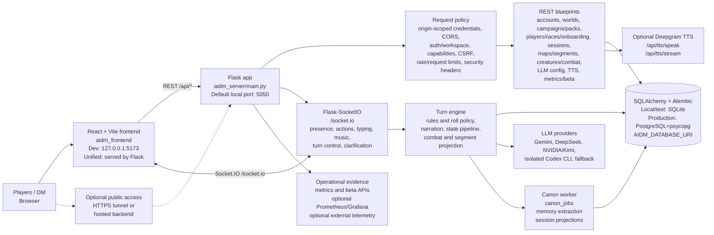
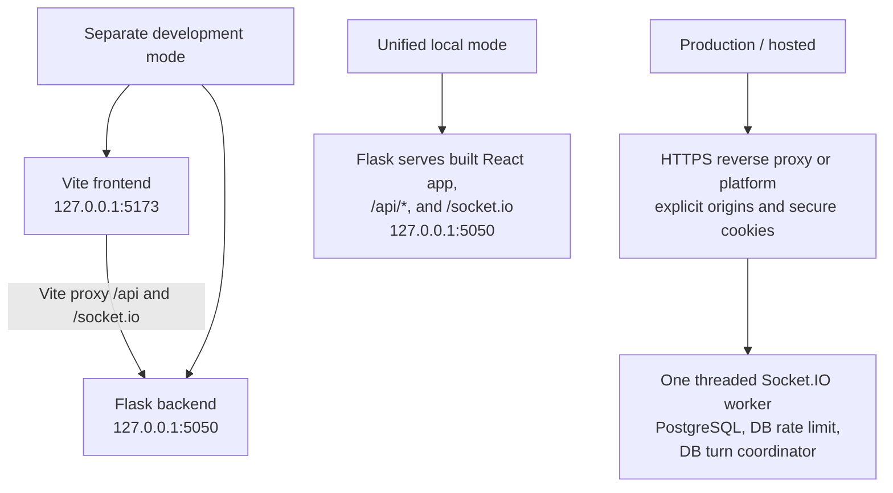

# AIDM Block Diagram

This is the canonical high-level runtime map. The standalone
[HTML block diagram](block_diagram.html) mirrors this document for browser
viewing; update both when a runtime block changes. Detailed contracts are in
[API surface](api_surface.md), [runtime state boundaries](runtime_state_boundaries.md),
and [LLM provider routing](llm_provider_routing.md).

## Main Runtime Blocks



## Where Each Part Runs

| Block | Runs where | Main files / commands |
| --- | --- | --- |
| Frontend UI | Browser, from Vite during development or Flask in unified mode | `aidm_frontend/src`, `make frontend`, `make unified` |
| Backend API | Python Flask process; local launchers default to port `5050` | `aidm_server/main.py`, `scripts/run_local_backend.sh`, `make backend` |
| Unified app | One Flask origin serving built React assets, `/api/*`, and `/socket.io` | `scripts/run_unified_local.sh`, `make unified` |
| HTTP authorization | Flask request pipeline, before classified view execution | `aidm_server/capabilities.py`, `aidm_server/auth.py`, `aidm_server/workspace_access.py` |
| Realtime gameplay | Same backend process through Flask-SocketIO | `aidm_server/blueprints/socketio_events.py`, `aidm_server/socket_*.py` |
| Turn and state pipeline | Backend process, serialized by the turn coordinator | `aidm_server/turn_engine.py`, `aidm_server/game_state/`, `aidm_server/turn_events.py` |
| Canon work | Background thread in the single backend worker | `aidm_server/canon_jobs.py`, `aidm_server/canon_projection.py` |
| Database | SQLite for local/test; PostgreSQL with psycopg is required in production | `aidm_server/database.py`, `aidm_server/models.py`, `migrations/` |
| AI model calls | External provider API/CLI or deterministic local fallback | `aidm_server/llm_providers.py`, `aidm_server/provider_registry.py` |
| TTS | External Deepgram API when configured | `aidm_server/blueprints/system.py`, `/api/tts/*` |
| Metrics and beta evidence | Backend metrics/audit data; optional Prometheus/Grafana stack | `/api/metrics*`, `/api/beta/*`, `observability/` |

## API Surface

| Area | Representative REST paths |
| --- | --- |
| Accounts / workspaces | `/api/accounts/login`, `/api/accounts/workspace`, `/api/accounts/workspaces`, `/api/accounts/workspace/select`, `/api/accounts/me`, `/api/accounts/session` |
| System / health | Public `GET /api/health`; classified `/api/capabilities`, `/api/metrics*`, and `/api/beta/*` |
| Worlds / campaigns | CRUD under `/api/worlds` and `/api/campaigns`, plus archive/restore/workspace/chronicle/canon |
| Campaign packs | `/api/campaigns/pack-tools/*`, `/api/campaigns/example-packs*`, `/api/campaigns/installed-packs*`, `/api/campaigns/import-pack` |
| Players / races / onboarding | `/api/players/*`, `/api/races*`, `/api/custom-races*`, `/api/onboarding/*` |
| Sessions | `/api/sessions/start`, lifecycle, import/export, log/events/state, content settings, and pack progress |
| Maps / segments | CRUD/update paths under `/api/maps` and `/api/segments`, including player/DM map visibility and segment activation |
| Bestiary / creatures / combat | `/api/bestiary/*`, campaign/region bestiaries, `/api/creatures/*`, and `/api/sessions/<session_id>/combat/*` |
| Runtime AI config | `GET/PATCH/POST /api/llm/config` |
| TTS / feedback | `/api/tts/*`, `/api/feedback/coherence`, `/api/feedback/bad-turn` |

See [API surface](api_surface.md) for ownership, access classifications, error
envelopes, and incoming/outgoing Socket.IO events.

## Socket.IO Gameplay Flow

```mermaid
sequenceDiagram
    participant Browser
    participant Socket as Flask-SocketIO handlers
    participant Engine as TurnEngine
    participant DB as SQLAlchemy store
    participant LLM as LLM provider
    participant Canon as Canon worker

    Browser->>Socket: connect(auth token or account session)
    Browser->>Socket: join_session(session_id, player_id)
    Socket->>DB: verify session, player, workspace, capability
    Socket-->>Browser: active_players / player_joined
    Browser->>Socket: send_message(player input + client_message_id)
    Socket->>Engine: build validated TurnCommand
    Engine->>DB: deduplicate key; coordinate turn
    alt completed duplicate request
        Engine-->>Browser: turn_duplicate(existing turn_id)
    else incomplete committed request
        Engine->>DB: restore persisted command and pre-DM pipeline
        Engine->>LLM: resume narration without reroll/incoming write
    else authoritative roll request
        Engine->>DB: generate and commit canonical roll + player event
        Engine-->>Browser: roll_resolved(committed result)
    else non-roll turn
        Engine->>DB: write durable player event
    end
    Engine->>LLM: generate DM prompt/context for a new turn
    LLM-->>Engine: provider response or progressive chunks
    Engine-->>Browser: dm_response_start / dm_chunk / dm_response_end
    Engine->>DB: persist logs, events, state, and mutation audit
    Engine->>Canon: enqueue canon extraction job
    Canon->>DB: update story memory and projections
```

Codex DM narration consumes app-server agent-message deltas progressively and
reconciles them with the authoritative completed item. If app-server fails
before the first delta, the isolated `codex exec --json` completion path remains
available as a complete-response fallback.

## Database Map

SQLAlchemy models and Alembic migrations own the schema. The default local
database is:

```text
~/.aidm/dnd_ai_dm.db
```

`AIDM_DATABASE_URI` selects another database. Production validation requires a
`postgresql+psycopg` URI; SQLite remains supported for local and test runs.

| Group | Tables |
| --- | --- |
| Accounts and tenancy | `accounts`, `workspaces`, `account_workspace_memberships` |
| Core campaign content | `worlds`, `campaigns`, `maps`, `players`, `custom_races`, `npcs`, `campaign_segments`, `story_events` |
| Campaign packs | `installed_campaign_packs`, `campaign_packs`, `campaign_pack_records`, `campaign_pack_sessions`, `campaign_pack_checkpoint_progress`, `campaign_pack_progress_events` |
| Bestiary and combat | `bestiary_entries`, `combat_encounters`, `combat_debug_events` |
| Play history and live/projection state | `sessions`, `player_actions`, `session_log_entries`, `dm_turns`, `turn_events`, `session_states` |
| Canon memory | `story_entities`, `story_facts`, `story_threads`, `turn_canon_updates`, `canon_jobs` |
| Operations, audit, and safety | `session_state_mutation_audits`, `operator_action_audits`, `rate_limit_events`, `dm_coherence_feedback`, `session_turn_locks` |

## External Services And Main Env Vars

| Service | Purpose | Main environment variables |
| --- | --- | --- |
| Gemini | Main narration or helper generation | `AIDM_LLM_PROVIDER=gemini`, `GOOGLE_GENAI_API_KEY`, `AIDM_LLM_MODEL`, `AIDM_LLM_FALLBACK_MODELS` |
| NVIDIA / Kimi | OpenAI-compatible model generation | `AIDM_LLM_PROVIDER=nvidia` or `kimi`, `AIDM_NVIDIA_API_KEY`, `AIDM_NVIDIA_INVOKE_URL`, `AIDM_LLM_MODEL` |
| DeepSeek | OpenAI-compatible model generation | `AIDM_LLM_PROVIDER=deepseek`, `AIDM_DEEPSEEK_API_KEY`, `AIDM_DEEPSEEK_BASE_URL`, `AIDM_LLM_MODEL` |
| Codex CLI | Isolated CLI-backed generation | `AIDM_LLM_PROVIDER=codex_cli`, `AIDM_CODEX_EXECUTABLE`, `AIDM_CODEX_HOME`, `AIDM_CODEX_ACCESS_TOKEN`, `AIDM_LLM_MODEL` |
| Local fallback | Deterministic no-key local/test mode | `AIDM_LLM_PROVIDER=fallback`, `AIDM_LLM_MODEL=deterministic-v1` |
| Deepgram | Text-to-speech audio | `AIDM_DEEPGRAM_API_KEY`, `AIDM_DEEPGRAM_TTS_MODEL` |
| External telemetry | Optional event delivery outside the process | `AIDM_TELEMETRY_ENABLED`, `AIDM_TELEMETRY_ENDPOINT`, `AIDM_TELEMETRY_API_KEY` |
| Auth and sharing | Protect hosted or tunneled play sessions | `AIDM_AUTH_REQUIRED`, `AIDM_API_AUTH_TOKENS`, `AIDM_API_AUTH_TOKEN_WORKSPACES` |

## Deployment Shapes



In short: the browser runs the React UI; Flask owns REST, realtime access, turns,
and background canon work; SQLAlchemy stores durable state; and the backend
calls configured AI/TTS providers. Local runs can use SQLite, while production
uses PostgreSQL and the validated single-worker Socket.IO model.
